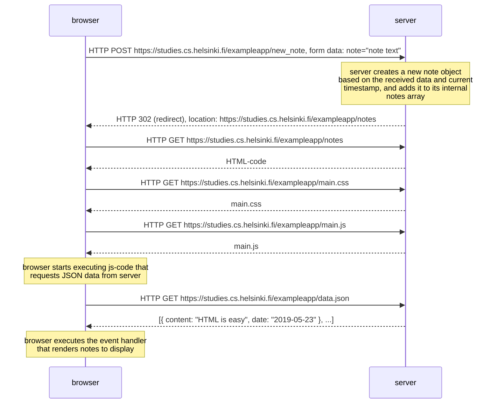

```mermaid
    sequenceDiagram
    browser->>server: HTTP POST https://studies.cs.helsinki.fi/exampleapp/new_note, form data: note="note text"

    Note over server: server creates a new note object <br/> based on the received data and current <br/> timestamp, and adds it to its internal <br/> notes array

    server-->>browser: HTTP 302 (redirect), location: https://studies.cs.helsinki.fi/exampleapp/notes
    browser->>server: HTTP GET https://studies.cs.helsinki.fi/exampleapp/notes
    server-->>browser: HTML-code
    browser->>server: HTTP GET https://studies.cs.helsinki.fi/exampleapp/main.css
    server-->>browser: main.css
    browser->>server: HTTP GET https://studies.cs.helsinki.fi/exampleapp/main.js
    server-->>browser: main.js

    note over browser: browser starts executing js-code that <br/> requests JSON data from server

    browser->>server: HTTP GET https://studies.cs.helsinki.fi/exampleapp/data.json
    server-->>browser: [{ content: "HTML is easy", date: "2019-05-23" }, ...]

    note over browser: browser executes the event handler <br/> that renders notes to display
```
