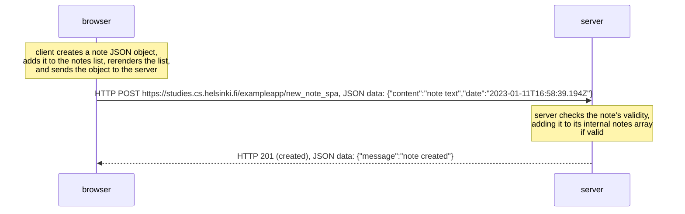

```mermaid
    sequenceDiagram
    Note over browser: client creates a note JSON object, <br/> adds it to the notes list, rerenders the list, <br/> and sends the object to the server
    browser->>server: HTTP POST https://studies.cs.helsinki.fi/exampleapp/new_note_spa, JSON data: {"content":"note text","date":"2023-01-11T16:58:39.194Z"}

    Note over server: server checks the note's validity, <br/> adding it to its internal notes array <br/> if valid

    server-->>browser: HTTP 201 (created), JSON data: {"message":"note created"}
```
